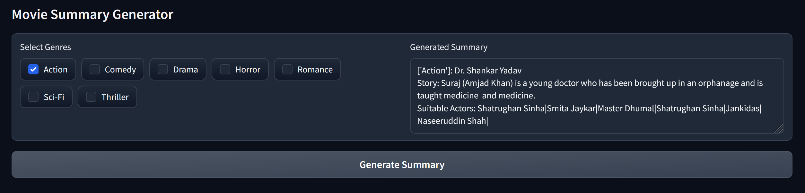
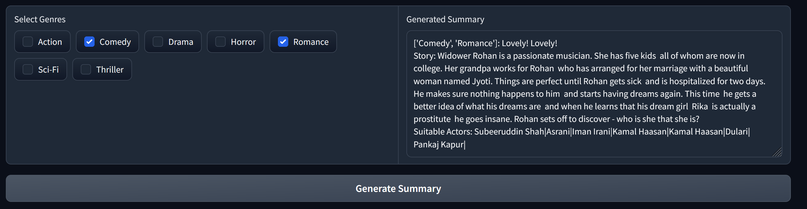
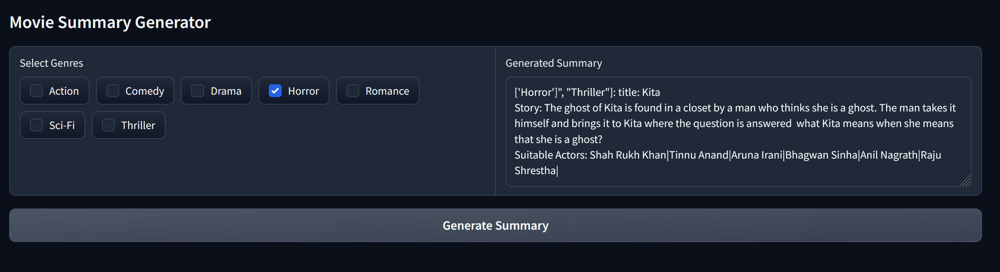

# Bollywood - GPT

I fine tuned a GPT-2 model on a corpus contain 4000+ Bollywood movies along with their title, genre, summaries and actors
so that it can generate the summary, title and possible actors of a totally new bollywood movie when provided a list of genres.

## Usage

The model and its interface can be found [here](https://huggingface.co/spaces/Vangmayy/Bollywood-gpt)

- Select the genres available
- User can select a single or multiple genres
- When you click the generate summary button the summary of the story will be generate

